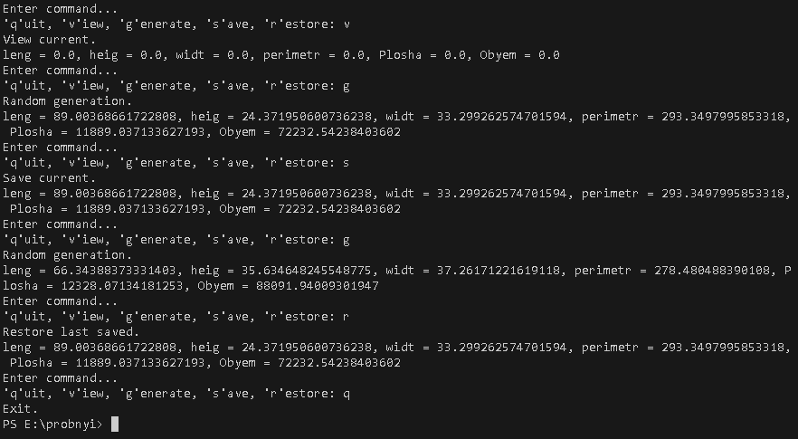

 # Практика з ООП
 Доровских Д. О., 35 група  
 Студент Відокремленого структурного підрозділу "ППФК НТУ "ХПІ"  
   
 **Завдання 2**  
 **Тема:** Класи та об'єкти  
1. Індивідуальне завдання:  
Визначити периметр, площу та об'єм приміщення за заданими двійковими значеннями довжини, ширини та висоти.  
2. Загальне завдання:  
    2.1. Розробити клас, що серіалізується, для зберігання параметрів і результатів обчислень.  
    2.2. Використовуючи агрегування, розробити клас для знаходження рішення задачі.  
    2.3. Розробити клас для демонстрації в діалоговому режимі збереження та відновлення стану об'єкта, використовуючи серіалізацію.  
    2.4. Показати особливості використання transient полів.  
    2.5. Розробити клас для тестування коректності результатів обчислень та серіалізації/десеріалізації.
    2.6. Використовувати докладні коментарі для автоматичної генерації документації засобами javadoc.  
**Скріншот виконання робочої програми (папка ex01):**  

