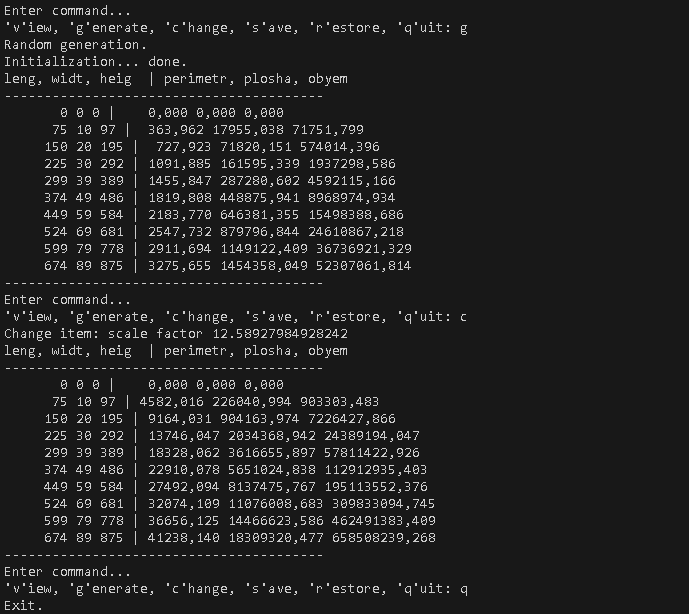

 # Практика з ООП
 Доровских Д. О., 35 група  
 Студент Відокремленого структурного підрозділу "ППФК НТУ "ХПІ"  
 ____  
 **Завдання 2**  
 **Тема:** Класи та об'єкти  
1. Індивідуальне завдання:  
Визначити периметр, площу та об'єм приміщення за заданими двійковими значеннями довжини, ширини та висоти.  
2. Загальне завдання:  
    2.1. Розробити клас, що серіалізується, для зберігання параметрів і результатів обчислень.  
    2.2. Використовуючи агрегування, розробити клас для знаходження рішення задачі.  
    2.3. Розробити клас для демонстрації в діалоговому режимі збереження та відновлення стану об'єкта, використовуючи серіалізацію.  
    2.4. Показати особливості використання transient полів.  
    2.5. Розробити клас для тестування коректності результатів обчислень та серіалізації/десеріалізації.  
    2.6. Використовувати докладні коментарі для автоматичної генерації документації засобами javadoc.  
**Скріншот виконання робочої програми (папка ex01):**  
  
____  
**Завдання 3**  
 **Тема:** Спадкування  
 Загальне завдання:  
1. Як основу використовувати вихідний текст проекту попередньої лабораторної роботи (Завдання 2).  
2. Забезпечити розміщення результатів обчислень у колекції з можливістю збереження відновлення.  
3. Використовуючи шаблон проектування Factory Method (Virtual Constructor), розробити ієрархію, що передбачає розширення рахунок додавання нових відображуваних класів.  
4. Розширити ієрархію інтерфейсом "фабрикованих" об'єктів, що представляє набір методів для відображення результатів обчислень.  
5. Реалізувати ці методи виведення результатів у текстовому виді.  
6. Розробити та реалізувати інтерфейс для "фабрикуючого" методу.  
**Скріншот виконання робочої програми (папка ex02):**  
  
____  
**Завдання 4**  
 **Тема:** Поліморфізм  
 Загальне завдання:  
1. За основу використовувати вихідний текст проекту попередньої лабораторної роботи.  
2. Використовуючи шаблон проектування Factory Method (Virtual Constructor), розширити ієрархію похідними класами, реалізують методи для подання результатів у вигляді текстової таблиці. Параметри відображення таблиці мають визначатися користувачем.  
3. Продемонструвати заміщення (перевизначення, overriding), поєднання (перевантаження, overloading), динамічне призначення методів (Пізнє зв'язування, поліморфізм, dynamic method dispatch).  
4. Забезпечити діалоговий інтерфейс із користувачем.  
5. Розробити клас для тестування основної функціональності.  
6. Використати коментарі для автоматичної генерації документації засобами javadoc.  
**Скріншот виконання робочої програми (папка ex03):**  
  
____  
**Завдання 5**  
 **Тема:** Обробка колекцій  
 Загальне завдання:  
1. Використовуючи створені раніше класи та шаблон проектування Command, розробити клас Menu як контейнер команд, що розширюється, реалізувати обробку даних колекції та окремих елементів (масштабування, інтерполяція, нормалізація, сортування, пошук і т.д.).  
2. Реалізувати можливість скасування (undo) операцій (команд).  
3. Продемонструвати поняття "макрокоманда".  
4. Під час розробки програми використовувати шаблон Singletone.  
5. Забезпечити діалоговий інтерфейс із користувачем.  
6. Розробити клас для тестування функціональності програми.  
7. Використати коментарі для автоматичного створення документації засобами javadoc.  
**Скріншот виконання робочої програми (папка ex03):**  
  
____  